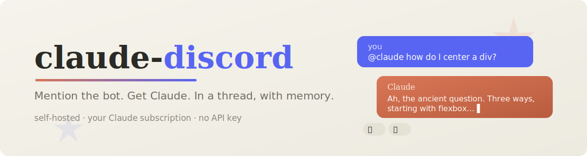

<p align="center">
  
</p>

<p align="center">
  <a href="https://github.com/t11z/claude-discord/actions/workflows/ci.yml"></a>
  <a href="LICENSE"></a>
  <a href="https://t11z.github.io/claude-discord/"></a>
  <a href="https://github.com/t11z/claude-discord/pkgs/container/claude-discord"></a>
  = 20" />
</p>

<h3 align="center">Mention the bot. Get Claude. In a thread, with memory.</h3>

<p align="center">
  <b>claude-discord</b> brings the <code>@claude</code> experience you know from GitHub to your Discord server —
  self-hosted, open source, and powered by the <b>Claude subscription you already pay for</b>
  (via a Claude Code OAuth token) instead of a metered API key.
</p>

---

## How it feels

```
#general
  you      @Claude our deploy script keeps timing out, any ideas? 📎 deploy.sh
  Claude   👀
  └─ 🧵 "our deploy script keeps timing out…"
       Claude   Looking at your script, three things stand out… ▌   ← grows live
       you      can you rewrite it with retries?
       Claude   Sure — here's the updated script: …                 ✅
```

One mention opens a thread. Everything in that thread is one conversation —
Claude remembers all of it, even across bot restarts.

## Features

| | |
| --- | --- |
| 🧵 **Threads with memory** | Every conversation maps to a persistent Claude session (`resume` under the hood) |
| 🔑 **Subscription auth** | `claude setup-token` → done. No API key, no per-token bill. API key works as fallback |
| ⚡ **Streaming feel** | 👀 → live-growing reply → ✅. Code fences are never split across messages |
| 📎 **Attachments** | Send text files and images; long answers come back as `response.md` |
| 🎛️ **Admin dashboard** | Setup wizard, channel/role allowlists, live sessions, usage stats — in a Claude×Discord themed UI |
| 🤖 **Agentic mode (opt-in)** | File & shell tools in per-thread sandboxes. Off by default, admin-gated, Docker-first |
| 🐙 **GitHub integration (opt-in)** | Give it a token and agentic threads clone, push & open PRs via `git`/`gh`. Fine-grained tokens encouraged |
| 🚦 **Limit-aware** | Per-server queue, friendly "resets at 3pm" messages, `/usage` command |
| 🐳 **One-container deploy** | `docker compose up -d` and you're live |

## Quickstart

**You need:** a Claude Pro/Max subscription (or an API key), Docker, and 5 minutes.

```bash
# 1. Get a token (on any machine with Claude Code)
claude setup-token

# 2. Run the bot
git clone https://github.com/t11z/claude-discord.git
cd claude-discord
docker compose up -d

# 3. Finish in the browser
open http://localhost:3000   # setup wizard: paste tokens, invite the bot
```

Then mention the bot in any channel. That's it.

📚 **[Full documentation →](https://t11z.github.io/claude-discord/)** — setup
guides, configuration reference, security notes and maintainer docs.

## Commands

| Command | |
| --- | --- |
| `@Claude …` | Start a conversation (opens a thread) |
| `/ask` | One-shot question, optionally private |
| `/reset` | Make Claude forget the current thread |
| `/usage` | Server usage & queue stats |
| `/model` | Sonnet / Opus / Haiku for new threads *(admin)* |
| `/config` | Allowlists, agentic mode, on/off *(admin)* |

## A note on security & fair use

- **Agentic mode** gives Claude shell access inside a sandbox. It's off by
  default for a reason — read the
  [security docs](https://t11z.github.io/claude-discord/guide/access-control/)
  before enabling it, and run the bot in Docker.
- claude-discord is designed for **personal servers and small communities**:
  you self-host it with *your own* token, and everyone who talks to the bot
  shares *your* subscription limits. It is not built to be a public bot
  service.

## Contributing

Contributions are very welcome — this project is deliberately built to be
hackable: TypeScript everywhere, no ORM, no framework magic, pure functions
where it counts, and a documented
[architecture](https://t11z.github.io/claude-discord/maintainer/architecture/).

- 🟢 Start with a [`good first issue`](https://github.com/t11z/claude-discord/labels/good%20first%20issue)
- 📖 Read [CONTRIBUTING.md](CONTRIBUTING.md) (5-minute dev setup)
- 💬 Or just open a [discussion](https://github.com/t11z/claude-discord/discussions) — ideas welcome

```bash
npm install && npm run dev     # bot
npm run dev:dashboard          # dashboard with hot reload
npm test                       # no tokens needed
```

## License

[MIT](LICENSE) — do whatever makes your server happier.

---

<p align="center">
  <sub>Not affiliated with Anthropic or Discord. Claude is a trademark of Anthropic, PBC.</sub>
</p>
